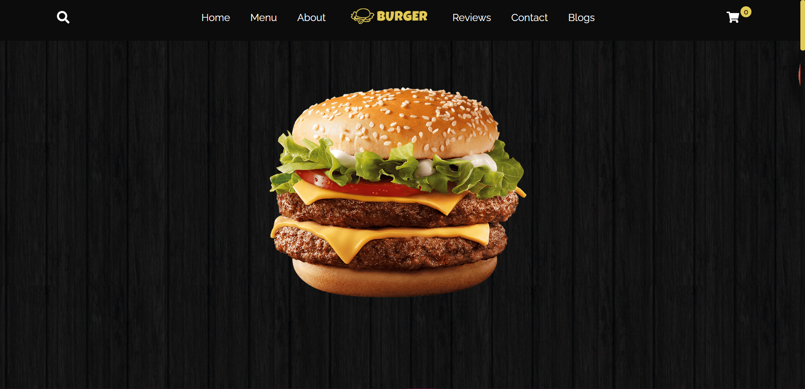
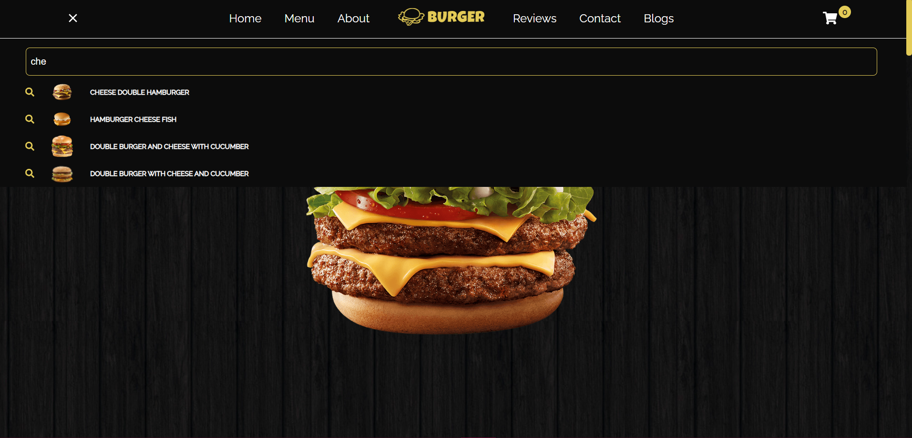
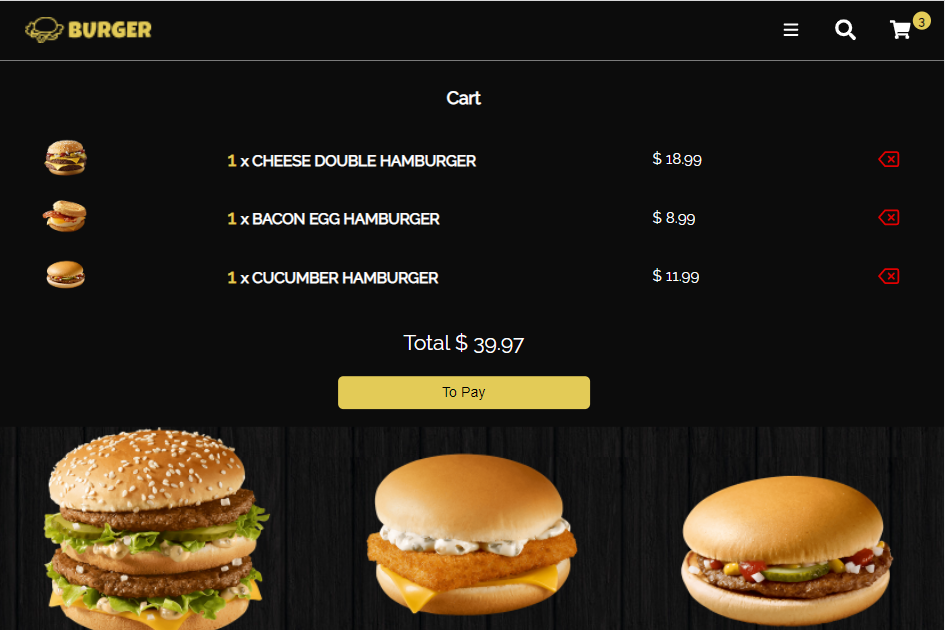
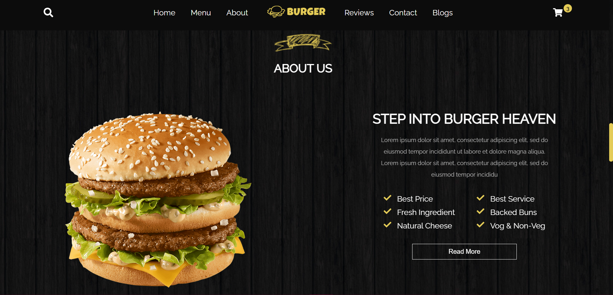
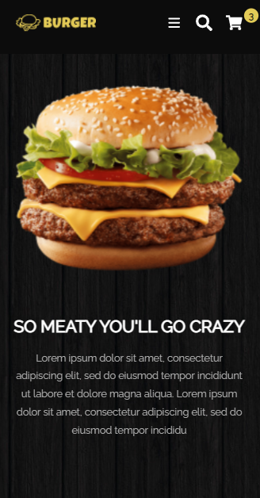

# This is my project created based on React JS, it is a landing page with different sections, with form validations, search engine, cart shop, and the design is made with CSS

This repository contains starter code for Burger Website in ReactJS.  

View Demo👇:  
https://burger-website-tda.netlify.app/  

### Images of Website Burger:

